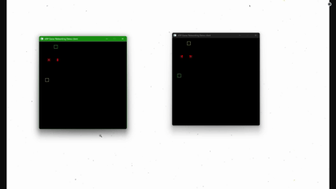

# Hi, I’m ExtraSoupGames
I am a passionate game developer interested in using and making tools to bring unique game ideas to life

## Tools
I have previously used exclusively Unity, but after learning C# and monogame, I branched out to my current toolset which consists of:
- Godot
- C++
- SDL3
- Typescript
- Babylon.js
- C#
- Unity

## Active Projects
### [Due Process](https://dueprocess.info)
I have been a contributor to Due Process since July 2025, fixing bugs and improving player experience for a large scale project in Unity with C#

### Loco-comotives
I am developing a 3D train management game in Godot called Loco-comotives, the code for this is available on request, and it is still in very early development

## Past Projects
### [UDP Game Networking](https://github.com/ExtraSoupGames/UDPGameNetworking)
An engine agnostic UDP game networking library built in C++ with SDL3
Features include message acknowledgement, value streaming, and lerping

### [Tidal Tussle](https://github.com/ExtraSoupGames/Ship-game-client)
A small game demo about fighting enemies off of a ship, utilises custom UDP networking with SDL to facilitate up to 4 players with minimal stuttering

### [Through the Thicket](https://github.com/ExtraSoupGames/ThroughTheThicket)
A game demo made in Unity to explore and compare procedural generation techniques. Utilises Wave function collapse and Cellular automata to generate different regions in a world

### [VRProject](https://github.com/ExtraSoupGames/VR-Project)
A small VR game demo made in a group using Unity and OpenXR to teach people about the universe, while maintaining accessibility using OpenXR features

### [Traffic Game](https://github.com/ExtraSoupGames/TrafficGame)
A very small traffic game built with Typescript and Babylon.js, playable [Here](https://extrasoupgames.github.io/TrafficGame)

